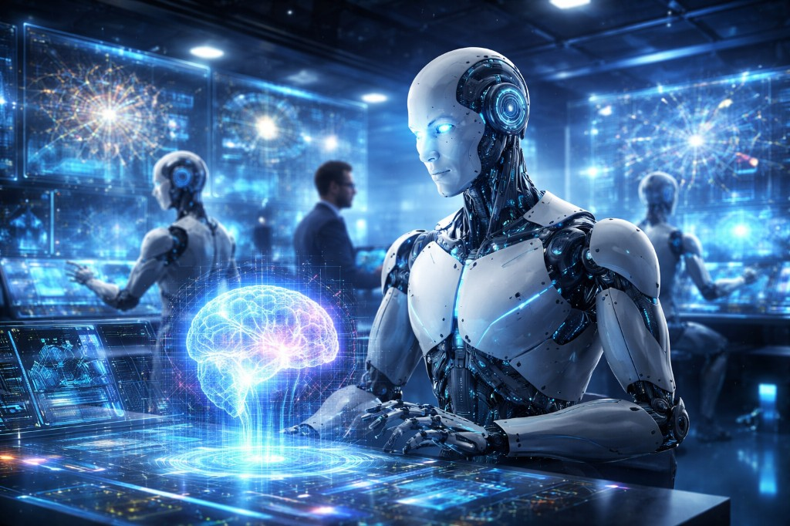

# ai-omniverse

**One stop for AI/ML learning** — AL/ML learning Gym including traditional ML, deep learning, fine-tuning, Gen AI, Agentic AI. Everything from experiments to production with evaluation and observability.

This repo is a curated learning path covering the full spectrum of modern AI and machine learning:


|   **Area**   | **Coverage** |
|--------------|--------------|
| **Traditional ML** | Fundamentals: regression, classification, clustering, feature engineering, and model evaluation. |
| **Deep Learning** | Neural networks, CNNs, RNNs, transformers, and training at scale. |
| **Gen AI & LLMs** | Building applications with large language models: prompting, RAG, advance RAG, agentic RAG, and deployment. |
| **Fine Tuning (SFT)** | Fine-tuning small language models ( PEFT e.g. LoRA, QLoRA, adapters) on custom data. You can perform SFT using Full Fine-Tuning (expensive) or LoRA/QLoRA (efficient).|
| **RLHF Pipeline** | RLHF pipeline (SFT → Reward model → PPO). |
| **Agentic AI** | Autonomous agents, tool use, multi-step reasoning, and agent frameworks. |
| **MLOps** | Experiment tracking, model versioning, pipelines, serving, and monitoring in production, along with EVALs and observability. |


Course repos and materials are organized by track below.

<p align="center">
  
</p>
<p align="center"><em>Studying AI & agents for the future</em></p>


---

## 1. LLM Core Track

| **Topic** | **Repo** | **Description** |
|-----------|----------|-----------------|
| LangChain Basics | [ai-langchain-intro](https://github.com/aditya-caltechie/ai-langchain-intro) | Introduction to LangChain: chains, prompts, output parsers, and connecting to LLMs. Covers the core building blocks for LLM applications. |
| Deep Learning | [ai-deep-learning](https://github.com/aditya-caltechie/ai-deep-learning) | Deep learning fundamentals with PyTorch/TensorFlow: neural networks, CNNs, RNNs, and training pipelines. Foundation for understanding how modern LLMs are built. |
| Fine-tuning (SFT) | [ai-fine-tuning](https://github.com/aditya-caltechie/ai-fine-tuning) | Fine-tuning small language models (e.g. LoRA, QLoRA, adapters) on custom data. Covers data prep, training, and evaluation for domain-specific models. |
| RLHF pipeline | Todo | Yet to explore. |
| RAG | [ai-rag](https://github.com/aditya-caltechie/ai-rag) | Retrieval-augmented generation: vector stores, embeddings, and chaining retrievers with LLMs for knowledge-grounded answers. |
| Agentic RAG| [ai-agentic-rag](https://github.com/aditya-caltechie/ai-agentic-rag) | Agentic RAG: agents that decide when and how to search and reason over retrieved context using LangChain/LangGraph-style patterns. |
| AI Agent using Tools/loop & Workflows | [ai-deals2buy](https://github.com/aditya-caltechie/ai-deals2buy) | Capstone: AI agent for deals/shopping with LLM calls, tools, and agent logic. Two approaches: (a) loops & tools via `autonomous_planning_agent.py`, (b) workflow via `planning_agent.py`. |

---

## 2. Agentic Core Track

| **Topic** | **Repo** | **Description** |
|-----------|----------|-----------------|
| OpenAI Agents SDK | [ai-agentic-sales-outreach](https://github.com/aditya-caltechie/ai-agentic-sales-outreach) | Cold-send agent project: agentic cold sales email with tools and handoffs strategies. Uses worksflows and agent approach. Use guardrails |
| OpenAI Agents SDK | [ai-openai-sdk-deep-research](https://github.com/aditya-caltechie/ai-agent-sdk-deep-research) | Perform Deep Research |
| MCP (Model Context Protocol) | [ai-mcp-autonomous-traders](https://github.com/aditya-caltechie/ai-mcp-autonomous-traders) | Autonomous trading agents using MCP: agents that use tools and context via the Model Context Protocol for trading workflows. |
| CrewAI Framework | [ai-crew-engineering-team](https://github.com/aditya-caltechie/ai-crew-engineering-team) | Multi-agent "engineering team" with CrewAI: role-based agents collaborating on tasks. Demonstrates CrewAI's agent and task APIs. |
| CrewAI Framework | [ai-crew-financial-researcher](https://github.com/aditya-caltechie/ai-crew-financial-researcher) | Financial research agent built with CrewAI: research tasks, tools, and structured outputs for finance use cases. |
| CrewAI Framework | [ai-crew-stock-picker](https://github.com/aditya-caltechie/ai-crew-stock-picker) | Stock-picking agent with CrewAI: agents that analyze and recommend stocks using external data and tools. |
| LangGraph | [ai-sidekick](https://github.com/aditya-caltechie/ai-sidekick) | Personal Assistance, that backs you up and helps you get things done  |
| Autogen | — | *Links to be added.* |


---

## 3. MLOps Track

| **Topic** | **Repo** | **Description** |
|-----------|----------|-----------------|
| Deploy Gen AI & Agentic AI in Production | [MLOps-production](https://github.com/aditya-caltechie/ed-donner-MLOps-production) | Course repo: deploy Gen AI and Agentic AI at scale in 4 weeks. Covers production deployment, guides, and week-by-week materials. |

---

## Study Notes

| **Repo** | **Description** |
|----------|-----------------|
| [ai-tutorial-notes](https://github.com/aditya-caltechie/ai-tutorial-notes) | Consolidated notes and references from Udemy AI/ML courses. Quick lookup for concepts, commands, and patterns used across the tracks. |

---
# Appendix :

### Frameworks:

OpenAI Agents SDK, CrewAI, and AutoGen are all **true agent frameworks** (or orchestration frameworks). They're built specifically to let you quickly spin up AI agents (or teams of agents) with opinionated patterns:

- OpenAI Agents SDK → lightweight, production-ready primitives for single/multi-agent orchestration (successor vibe to Swarm).
- CrewAI → role-based "crews" where agents have jobs, tasks, and handoffs like a human team.
- AutoGen → conversation-based multi-agent chats where agents talk to each other to solve problems.

They're designed end-to-end for "build an agent/team fast."
LangChain / LangGraph sit in a different bucket.

##### LangChain / LangGraph sit in a different bucket.
LangChain is a general LLM application **framework** (chains, memory, RAG, tools, etc.). LangGraph is its stateful graph layer for building custom workflows with cycles, branching, and multi-actor control flow. You can build agents with them (tons of people do), but they're lower-level building blocks rather than ready-made "agent frameworks." You have to design most of the orchestration yourself — it's more like "React for agents" than "a crew/team builder." 

LangGraph is very much a framework, but it's a different kind compared to things like CrewAI, AutoGen, or OpenAI Agents SDK — which is why it can feel like it doesn't "fit" the same bucket.

The key distinction comes down to level of abstraction and opinionation:

- Higher-level / opinionated agent frameworks (CrewAI, AutoGen, OpenAI Agents SDK, etc.)
These give you ready-made patterns: "agents with roles," "conversations between agents," "handoffs/swarm-style delegation," predefined task queues, automatic tool routing, etc. You mostly configure agents/roles/tasks, and the framework handles a lot of the orchestration "magic" for you. Great for speed → build a team of agents in ~100 lines.

- LangGraph (and to some extent LangChain itself)
It's a low-level orchestration framework / agent runtime built around explicit, programmable graphs (directed graphs with nodes, edges, conditional branches, cycles/loops, persistence). LangGraph is a framework — specifically a low-level, graph-based agent orchestration framework/runtime for stateful, controllable, production-grade AI agents and workflows.

##### MCP (Model Context Protocol) :
It is even further removed — it's not a framework at all. It's a protocol/standard. It just defines a clean, standardized way for any agent to discover and call tools/context/resources from MCP servers.

---

### Fine-Tuning Terminology (SFT vs LoRA vs Full FT)

| **Term**             | **Category**       | **What it describes**                                                     |
|----------------------|--------------------|---------------------------------------------------------------------------|
| **SFT**              | Learning Paradigm  | Using labeled *input/output* data to teach a specific behavior.          |
| **Full Fine-Tuning** | Resource Method    | Modifying **100%** of the model's weights during SFT.                    |
| **LoRA / QLoRA**     | Resource Method    | Modifying **< 1%** of the model's weights during SFT (parameter-efficient). |

---

### Stages vs. What They Learn

| **Stage**      | **What is learned?**          | **Analogy**                                |
|---------------|--------------------------------|--------------------------------------------|
| **SFT**       | Domain knowledge & format      | Learning the textbook for a class.         |
| **DPO / RLHF**| Style, safety, & preference    | Taking practice exams and getting a grade. |

---

### Two-Stage Adaptation Pattern

| **Stage** | **Goal**                          | **Typical method**                                   | **Notes**                                                                                           |
|----------|------------------------------------|------------------------------------------------------|-----------------------------------------------------------------------------------------------------|
| **Stage 1 – Task & domain (SFT)** | Teach domain knowledge, task behavior, and output format. | Supervised Fine-Tuning (SFT), usually with **LoRA / QLoRA** instead of full fine-tuning. | Parameter‑efficient; far less compute and memory than full FT, and often sufficient to ship a product. |
| **Stage 2 – Alignment & refinement** | Refine style, helpfulness, safety, and response quality. | Preference-based alignment via **DPO** or **RLHF** on preference data. | Optional second pass; most valuable when UX and safety need additional optimization.                   |

---

### RLHF

Something yet to explore RLHF :
```
Supervised Fine-Tuning (SFT)
 - High-quality instruction-response pairs
 - Teaches model SQL generation patterns
 ↓
Reward Model Training
 - Preference learning (good vs bad SQL)
 - Learns to score SQL quality
 ↓
PPO Optimization (RLHF)
 - Uses reward model as critic
 - Optimizes for better SQL generation
 ↓
Final PPO Model
 - Optimized for your RAG use case
 - Better at generating clean, correct SQL
```
