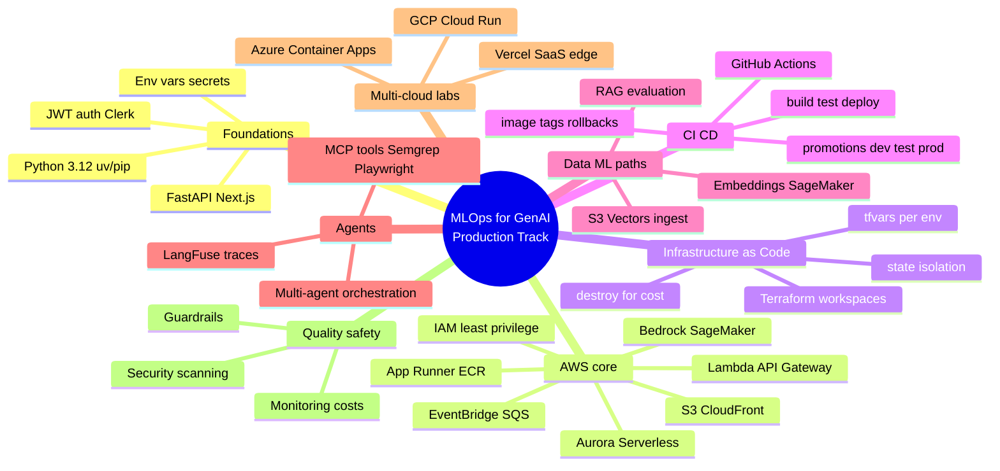
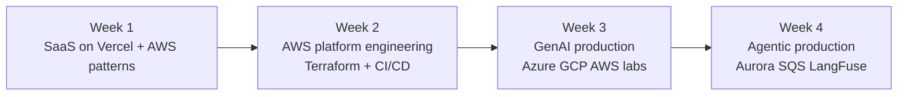
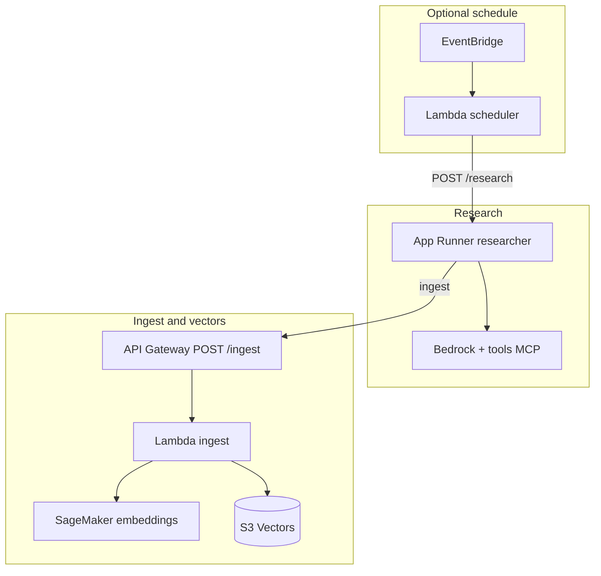
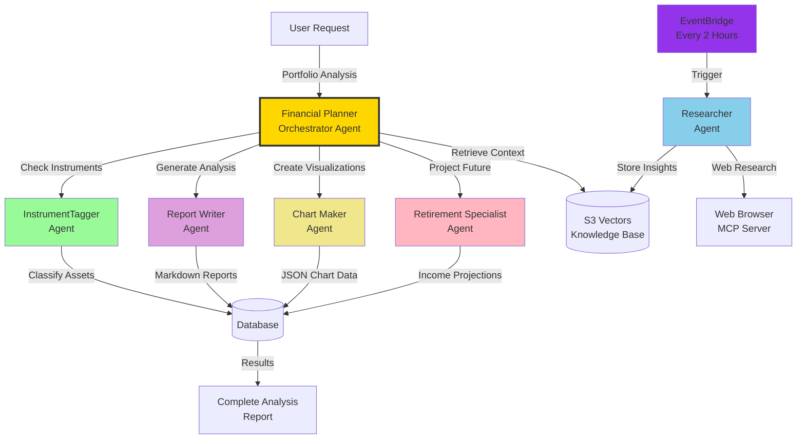

# MLOps & AI Production Track

This document brief—“AI Engineer Production Track: Deploy LLMs & Agents at Scale”—into a **sequenced MLOps learning path**. It ties **four course projects** to concrete tooling (especially **AWS**, **Terraform**, and **CI/CD**), explains **what to understand before each step**, and highlights **what to emphasize from an MLOps point of view** when you read each repository’s README and guides.

**Source roadmap themes:** deploy to **AWS, GCP, Azure, Vercel**; use **MLOps**, **Bedrock**, **SageMaker**, **RAG/agents**, **MCP**; ship systems that are **scalable, secure, observable**, with **IaC** and **hands-free deployments** (e.g. GitHub Actions).

Refer [NOTES](https://github.com/aditya-caltechie/ai-tutorial-notes/tree/main/mlops) first for course overview. 
Then individual [md-files](https://github.com/aditya-caltechie/ed-donner-MLOps-production) for instructions to deployment on AWS with terraform.

---

## 1. What this track is (and is not)

| Aspect | This track **is** | This track is **not only** |
|--------|-------------------|----------------------------|
| Goal | Repeatable **build → test → deploy → observe → iterate** for LLM apps | A pure data-science notebook course |
| Core skill | **Platform thinking**: envs, secrets, infra, pipelines, cost, rollback | Only prompt engineering |
| Cloud | **AWS-first** in depth; **Azure/GCP** where the course widens (Week 3) | Single-vendor-only forever |
| Ops | **Terraform**, containers, serverless, **observability** | Ad-hoc console-only deploys |

---

## 2. Roadmap mind map (topics you must cover)

The diagram below is a **study mind map**: use it to check prerequisites and to see how Week 1–4 projects hang together.



---

## 3. Four-week arc (from Week 0) → projects and MLOps focus

This mirrors the **course sections** in the roadmap: each **week** is a **product** you take toward production.



| Week | Roadmap label | Example repo | Primary MLOps story |
|------|----------------|--------------|---------------------|
| 1 | SaaS live: Vercel, AWS, Next.js, Clerk, App Runner | [ai-healthcare-pro](https://github.com/aditya-caltechie/ai-healthcare-pro) | **SaaS delivery**: auth, env parity, streaming API, hosted deploy (Vercel); optional AWS container path |
| 2 | AI platform on AWS: Bedrock, Lambda, API Gateway, Terraform, CI/CD | [ai-digital-twin](https://github.com/aditya-caltechie/ai-digital-twin) | **Serverless + static front**: API Gateway → Lambda, S3 memory, CloudFront, IaC mindset |
| 3 | GenAI: Azure, GCP, SageMaker, S3 Vectors, MCP | [ai-cybersecurity-analyzer](https://github.com/aditya-caltechie/ai-cybersecurity-analyzer) (Azure/GCP) + [ai-financial-planner](https://github.com/aditya-caltechie/ai-financial-planner) (AWS-heavy) | **Multi-cloud Terraform** vs **deep AWS data plane** (vectors, inference, agents) |
| 4 | Agentic: Aurora, Lambda, SQS, LangFuse, Bedrock Agent Core | [ai-financial-planner](https://github.com/aditya-caltechie/ai-financial-planner) | **Enterprise agentic**: queues, DB, observability, multi-agent |

---

## 4. End-to-end “platform” view (ASCII)

This is the **spine** most projects follow: code in Git, config as env + IaC, run on cloud managed services, observe and control cost.

```
┌───────────────────────────────────────────────────────────────────────-──────┐
│  DEVELOPER                                                                   │
│    git push ──► CI (lint/test/build) ──► CD (terraform apply / deploy script)│
└───────────────────────────────────────────────────────────────────────────-──┘
         │                              │
         ▼                              ▼
┌─────────────────┐            ┌────────────────────────────────────────────┐
│  Artifact       │            │  RUNTIME (example AWS-heavy)               │
│  container zip  │            │  CloudFront ─► S3 (static UI)              │
│  static export  │            │  API GW ─► Lambda / App Runner             │
└─────────────────┘            │  Bedrock / SageMaker ◄► S3 / Aurora / SQS  │
                               │  IAM · CloudWatch · LangFuse / alarms      │
                               └────────────────────────────────────────────┘
```

---

## 5. Repository-by-repository: what to read and what to highlight (MLOps)

Below, **“Read first”** points at typical entry docs; each repo’s tree may vary slightly—start from root `README.md` and follow links.

### 5.1 [ai-healthcare-pro](https://github.com/aditya-caltechie/ai-healthcare-pro) — Week 1 style SaaS

**What the app does:** Next.js + FastAPI consultation assistant; Clerk JWT to backend; **SSE streaming** to the browser; can run on **Vercel** (Python serverless or proxied local API in dev).

**Read first:** root `README.md`, then `docs/architecture.md`, `docs/backend.md`, `docs/frontend.md` (as linked from the README).

**MLOps highlights to study:**

| Topic | Why it matters |
|--------|----------------|
| **Environment parity** | Same variable *names* in `.env.local` and Vercel project settings—prevents “works on my machine.” |
| **Secrets** | Clerk keys + OpenAI key never committed; JWKS URL for token verification. |
| **Auth in the request path** | Every API call: `Authorization: Bearer …`—pattern for **zero-trust** backends. |
| **Streaming (SSE)** | Operational concern: timeouts, proxies, and error HTML vs `text/event-stream` (README troubleshooting). |
| **Deploy surface** | Vercel Git integration = **continuous delivery** for the UI/API bundle; roadmap also mentions **AWS App Runner** for similar container SaaS. |
| **Cost control** | README notes pausing **ECR/App Runner** when not needed—**ops hygiene**. |

**Typical sequence (local → prod):** install deps → run FastAPI on `:8000` + Next dev with rewrite → set env on host → `vercel` / Git deploy → verify `/api` and SSE.

---

### 5.2 [ai-digital-twin](https://github.com/aditya-caltechie/ai-digital-twin) — Week 2 AWS platform engineering

**What the app does:** Next.js chat UI → FastAPI → OpenAI; **session memory** locally or in **S3** when `USE_S3=true`; AWS path uses **API Gateway + Lambda**, static site on **S3**, optional **CloudFront**; **Terraform** present for infra; path toward **Bedrock** described in docs.

**Read first:** root `README.md`, `docs/aws-architecture.md`, `docs/flow.md`, week guides referenced in README (e.g. `.week2/day2.md` style paths as in repo).

**MLOps highlights:**

| Topic | Why it matters |
|--------|----------------|
| **Two modes: Day 1 local vs Day 2 AWS** | Same app; **feature flags** via env (`USE_S3`)—classic release pattern. |
| **Lambda packaging** | `deploy.py` + Docker-style packaging → teaches **immutable artifacts** for serverless. |
| **S3 for state** | Conversation JSON in a **dedicated memory bucket**—data lifecycle + IAM scoping. |
| **API Gateway + Lambda** | Managed API edge: throttling, stages, integration—**platform** concerns. |
| **CloudFront + CORS** | Tighten `CORS_ORIGINS` when you know the CDN URL—**security in deployment**. |
| **Terraform** | Infra as code for AWS resources—repeatable environments. |

Architecture detail and narrative (request flows, two buckets, CORS) live in the upstream doc: **[`docs/aws-architecture.md`](https://github.com/aditya-caltechie/ai-digital-twin/blob/main/docs/aws-architecture.md)**. The **Day 2** path is: static frontend on **S3** (optional **CloudFront**), **API Gateway (HTTP API)** → **Lambda** (FastAPI + **Mangum**), session JSON in a **separate S3 memory bucket**, **OpenAI** for completions today; **Bedrock** is the documented next step (IAM on the Lambda role). Optional **Route 53** for custom domains is covered in `docs/aws_route53.md` in that repo.

**PNG in repo (course slide):** [`docs/assets/deployment-architecture-new.png`](https://github.com/aditya-caltechie/ai-digital-twin/blob/main/docs/assets/deployment-architecture-new.png).

#### AWS services used (quick reference)

| AWS service | Role in *ai-digital-twin* |
|-------------|---------------------------|
| **S3** (2 buckets) | **Frontend:** static Next.js `out/` (public reads). **Memory:** private session JSON; **only Lambda’s IAM role** uses `GetObject` / `PutObject`. |
| **CloudFront** | Optional **HTTPS + CDN** in front of the S3 website origin; tighten `CORS_ORIGINS` on the API to this domain in production. |
| **Route 53** | Optional **DNS** for custom hostnames → CloudFront and/or API Gateway (`docs/aws_route53.md`). |
| **API Gateway** | **HTTP API** (`$default` stage): routes e.g. `GET /`, `GET /health`, `POST /chat`, CORS; invokes Lambda. |
| **Lambda** | Runs packaged **FastAPI** via **Mangum**; env vars: `OPENAI_API_KEY`, `USE_S3=true`, `S3_BUCKET`, `CORS_ORIGINS`, etc. |
| **IAM** | Lambda **execution role**: least-privilege policies for **S3 memory** (and Bedrock when enabled). |
| **Amazon Bedrock** | **Target:** replace OpenAI calls with in-region **InvokeModel** / chat—no third-party LLM API key for that hop. |
| **CloudWatch** | **Logs** (and metrics) for Lambda—default ops path for debugging. |

#### ASCII — two-path view (from upstream `aws-architecture.md`)

One branch serves the **website** (reads); the other handles **chat API** traffic each message. **Path (1)** is the “Yellow” static path; **Path (2)** is the “Blue” API path (Lambda talks to **S3 memory** and **OpenAI**).

```
         +---------------------------------------+
         |          Browser                      |
         |  loads UI  +  calls /chat             |
         +---------------------------------------+
              ^                             ^
              (1) HTML/JS/CSS, etc.         |  (2) POST /chat, GET /health
              cached at edge                |      (JSON over HTTPS)
              |                             |
   +----------+-----------+       +---------+----------+
   |      CloudFront      |       |   API Gateway      |
   |  CDN, HTTPS viewer   |       |   HTTP API         |
   +----------+-----------+       +---------+----------+
              |                             |
              v                             v
   +----------------------+       +----------------------+
   | S3: frontend bucket  |       | Lambda               |
   | static website host  |       | app + Mangum handler |
   +----------------------+       +----------+-----------+
                                             |
                        +--------------------+--------------------+
                        v                                         v
             +----------------------+                   +------------------+
             | S3: memory bucket    |                   | OpenAI API       |
             | read/write session   |                   | generate reply   |
             | JSON per session     |                   | (external SaaS)  |
             +----------------------+                   +------------------+
```

#### ASCII — target with Amazon Bedrock (from upstream “Next: Amazon Bedrock”)

Same browser → API Gateway → Lambda → S3 memory; only the **model side** changes to **Bedrock** (“Purple” in the course slide). Lambda execution role gets **`bedrock:InvokeModel`** (etc.) instead of relying on an OpenAI key for the LLM call.

```
                         +-----------------------------+
                         |          Browser            |
                         |  loads UI  +  calls /chat   |
                         +-----------------------------+
                           ^                 ^
              (1) static  |                 |  (2) API
              |           |                 |
   +----------+-----------+       +---------+----------+
   |      CloudFront      |       |   API Gateway      |
   +----------+-----------+       +---------+----------+
              |                             |
              v                             v
   +----------------------+       +----------------------+
   | S3: frontend         |       | Lambda               |
   | (static site)        |       | business logic       |
   +----------------------+       +----------+-----------+
                                             |
                        +--------------------+--------------------+
                        v                                         v
             +----------------------+                   +----------------------+
             | S3: memory           |                   | Amazon Bedrock       |
             | conversation history |                   | InvokeModel / chat   |
             | (read + write JSON)  |                   | (managed models)     |
             +----------------------+                   +----------------------+
```

---

### 5.3 [ai-cybersecurity-analyzer](https://github.com/aditya-caltechie/ai-cybersecurity-analyzer) — Week 3 multi-cloud (Azure & GCP)

**What the app does:** Next.js + FastAPI; **Semgrep** static analysis + **OpenAI Agents** + **Semgrep MCP**; **one Docker image** serves static UI + API on port 8000 in production.

**Read first:** root `README.md`, `docs/azure.md`, workshop docs under `docs/workshop/` (Azure/GCP paths referenced in README).

**MLOps highlights:**

| Topic | Why it matters |
|--------|----------------|
| **Single container** | Simpler **CD**: one image tag, one deploy target—good for small teams. |
| **Terraform Azure / GCP** | Same **IaC** discipline as AWS; **workspaces** (`terraform workspace`) in README—environment separation. |
| **Provider registration** | e.g. `Microsoft.App`—**platform onboarding** is part of MLOps. |
| **Rebuild vs apply** | README: bump **image tag** or **taint**—teaches **immutable releases** on Terraform-managed infra. |
| **Secrets as TF vars** | `-var="openai_api_key=..."` — in real orgs, prefer **secret manager** + CI injection; still understand the pattern. |
| **Semgrep + MCP** | **Policy-as-code** (rules) + **agent tools**—quality gate for code you analyze. |

**Destroy step:** `terraform destroy` when lab ends—**cost and safety** habit.

---

### 5.4 [ai-financial-planner](https://github.com/aditya-caltechie/ai-financial-planner) (“Alex”) — Week 3–4 capstone, AWS-deep

**What the app does:** Multi-agent **financial SaaS**: research → **ingest** → **embeddings** → **S3 Vectors**; **Bedrock** agents; **SageMaker** serverless embeddings; optional **EventBridge** → scheduler **Lambda** → **App Runner** researcher; later guides add **Aurora**, **SQS**, **CloudFront** JWT, **LangFuse**, etc.

**Read first:** root `README.md`, `guides/` in order (`1_permissions.md` → `8_enterprise.md`), `docs/3_architecture.md`, `docs/data-pipeline.md`, [`architecture.md`](https://github.com/aditya-caltechie/ai-financial-planner/blob/main/docs/4_agent_architecture.md) (agent roles and collaboration).

**MLOps highlights:**

| Topic | Why it matters |
|--------|----------------|
| **Terraform per phase** | Separate state under `terraform/*`—**blast radius** and incremental adoption. |
| **uv per backend package** | Reproducible Python **dependencies**—MLOps “same bits everywhere.” |
| **Containers (ECR) + App Runner** | Long-running **agent** service vs Lambda—**choose the right compute**. |
| **API Gateway + API keys** | Ingest path protection—**service-to-service** security. |
| **SageMaker serverless** | **Model serving** as a managed endpoint—latency + autoscaling concerns. |
| **S3 Vectors** | **Vector ops** at scale—index lifecycle, cost, IAM. |
| **EventBridge + Lambda** | **Scheduled jobs**—reliability, idempotency, dead letters (when you add them). |
| **Aurora + SQS** | **Transactional data** + **async work**—enterprise agentic patterns. |
| **LangFuse** | **Traces** for agents—**observability** for non-deterministic systems. |

**High-level automation + ingest (conceptual)**



#### Agent collaboration overview (from upstream `4_agent_architecture.md`)

How Alex’s agents work together: **Financial Planner** orchestrates specialists; **Researcher** runs on an **EventBridge** schedule and fills **S3 Vectors**; the planner also pulls context from vectors. Source: [`docs/4_agent_architecture.md`](https://github.com/aditya-caltechie/ai-financial-planner/blob/main/docs/4_agent_architecture.md).



---

## 6. Recommended sequence: tools and skills (step by step)

Follow this **order** when you are learning the track—not every tool appears in every repo, but this is the **dependency chain**.

1. **Version control & reviews**  
   Trunk-based or short-lived branches; PRs; **no secrets in Git** (use `.env.example` only).

2. **Local dev ergonomics**  
   `uv` for Python; Node LTS; **Docker** where READMEs require it (Lambda packages, App Runner images).

3. **Configuration**  
   12-factor style: **config via environment**; separate **dev / staging / prod** names and endpoints.

4. **AuthN/Z**  
   Clerk JWT (SaaS), API keys (ingest), IAM roles (AWS), later **JWT at CloudFront** (enterprise guide)—map each to a **threat model**.

5. **AWS building blocks (primary)**  
   IAM → S3 → Lambda → API Gateway → CloudFront → **Bedrock / SageMaker** → **VPC/Aurora** when needed.

6. **Terraform**  
   `init` / `plan` / `apply`; **workspaces** or separate dirs; **tfvars** per env; **destroy** in sandboxes.

7. **CI/CD (GitHub Actions per roadmap)**  
   Pipeline stages: install → test → build artifact → **deploy** (Terraform or script) → **smoke test**. Use **OIDC to AWS** in real accounts instead of long-lived keys when you adopt Actions seriously.

8. **Observability**  
   CloudWatch logs/metrics/alarms; **LangFuse** (agents); trace IDs across API and workers.

9. **Cost & safety**  
   Tag resources; set budgets/alerts; tear down labs; watch **SageMaker**, **Aurora**, **App Runner** spend.

10. **Multi-cloud awareness**  
    Azure/GCP Terraform from cybersecurity repo: **same practices**, different providers.

---

## 7. “MLOps vs ML engineering” in this course

| Question | ML engineering (classic) | MLOps emphasis here (GenAI) |
|----------|---------------------------|-----------------------------|
| What ships? | Training jobs, batch scores | **APIs**, **agents**, **RAG**, **streaming** |
| Artifacts | Weights, metrics | **Containers**, **Lambda zips**, **static sites**, **vector indexes** |
| Testing | Offline metrics | **Contracts**, **integration tests**, **canary**, **eval harnesses** for prompts |
| Monitoring | Drift | **Latency**, **errors**, **token cost**, **trace quality** |

---

## 8. Checklist: demo day / portfolio narrative

Use this when you explain projects in interviews or READMEs.

- **Architecture diagram** (one static, one request path).  
- **How you deploy** (Terraform directory, `deploy.py`, Vercel, Docker tag).  
- **Secrets** (where they live; rotation story).  
- **Failure modes** (timeouts, partial streams, queue backlog).  
- **Cost controls** (what you destroy; what scales to zero).  
- **Observability** (what you log; what you trace).  

---

## 9. Reference links (repos discussed)

- [ai-healthcare-pro](https://github.com/aditya-caltechie/ai-healthcare-pro)  
- [ai-digital-twin](https://github.com/aditya-caltechie/ai-digital-twin)  
- [ai-cybersecurity-analyzer](https://github.com/aditya-caltechie/ai-cybersecurity-analyzer)  
- [ai-financial-planner](https://github.com/aditya-caltechie/ai-financial-planner)  
