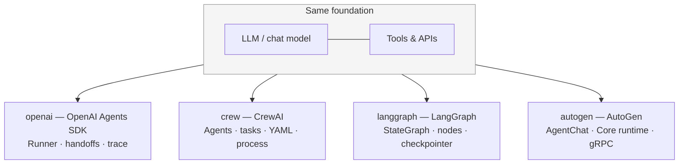
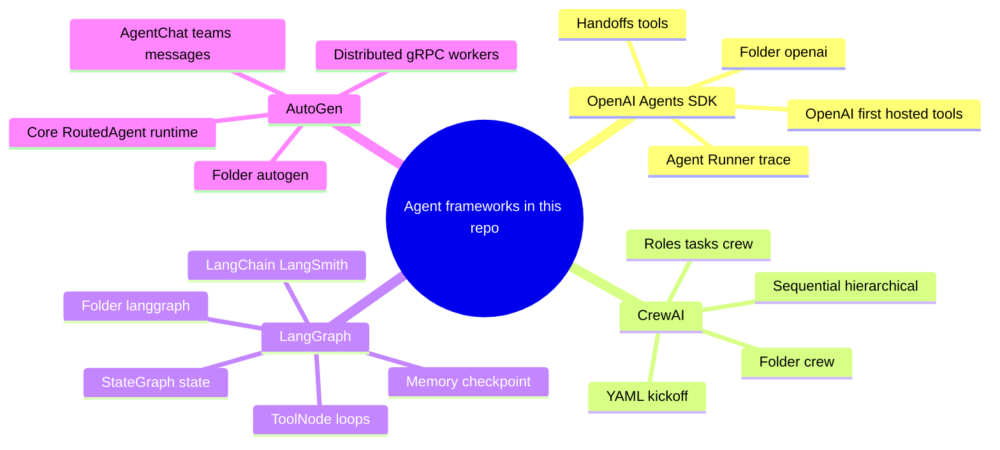
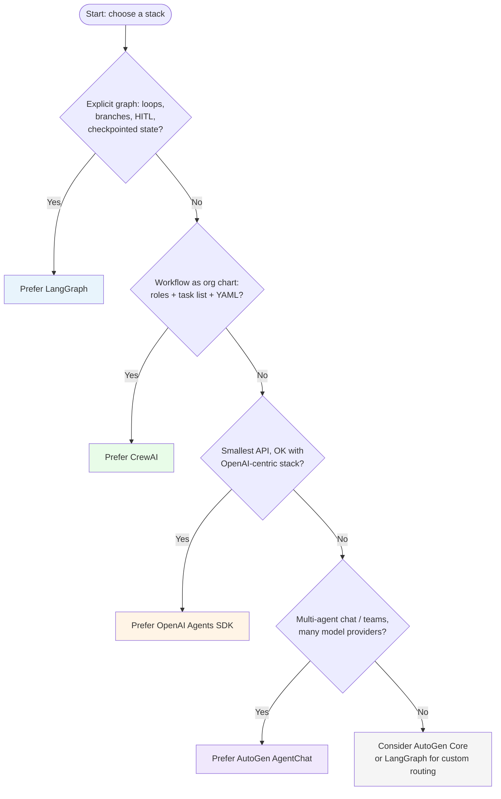

# Agent frameworks in this course (`openai`, `crew`, `langgraph`, `autogen`)

Here is a concise map of what each folder teaches, when to pick it, and how the pieces differ—aligned with this repo (`2_openai`, `3_crew`, `4_langgraph`, `5_autogen`).

## Visual overview (diagrams)

These use [Mermaid](https://mermaid.js.org/) (`mermaid` code fences). They render on GitHub, in many IDEs (e.g. Markdown preview with Mermaid), and in tools like Notion or Obsidian with a plugin. If preview shows raw code, install a Mermaid-capable preview or paste into [mermaid.live](https://mermaid.live).

### Shared foundation (block diagram)

Every stack sits on the same base: **LLM + optional tools + multi-step orchestration**. The boxes below are the *different control planes* you choose on top.

### Mind map (keywords per framework)

### Simplified “which one?” flow

This is a **tie-breaker**, not a rigid rule—many apps could be built two ways.

---

## 1. `openai` — **OpenAI Agents SDK**

**What it is:** A small, first-party-style layer on top of chat completions: define **agents**, run them with **`Runner`**, wire **tools** and **handoffs**, optional **tracing** (`trace`). Tightly oriented around OpenAI models and hosted tools (e.g. `WebSearchTool` in your Deep Research lab).

**Main components (in your course):**

- **`Agent`** — name, instructions, model, tools, handoffs, guardrails
- **`Runner.run`** — execute an agent (often async)
- **`function_tool`** — Python functions as tools
- **Handoffs** — delegate to another agent (collaboration without a separate “orchestrator” framework)
- **Guardrails / structured outputs** — `3_lab3.ipynb`
- **Deep Research** — `4_lab4.ipynb` + `deep_research/*.py` — planner, search, writer, email-style multi-step workflow

**When to use it:** You want **minimal code**, **fast iteration**, and you are fine being **OpenAI-first** (models + tools). Good for product features, internal automations, and patterns like “one agent calls tools, sometimes hands off to a specialist.”

**Example from your repo:** Cold-outreach email flow with tools + handoffs (`2_lab2.ipynb`); multi-agent research with web search (`4_lab4.ipynb`).

---

## 2. `crew` — **CrewAI**

**What it is:** **Role-based crews**: several **agents** with fixed personas run **tasks** in a **process** (your `engineering_team` uses `Process.sequential`). Config often lives in **YAML** (`agents.yaml`, `tasks.yaml`); Python glues it with `@CrewBase`.

**Main components:**

- **`Agent`** — role, backstory, tools (CrewAI’s agent, not the OpenAI SDK class)
- **`Task`** — concrete deliverable, often tied to an agent
- **`Crew`** — runs tasks in order (or hierarchical in other setups)
- **`kickoff(inputs=...)`** — run the pipeline with variables (e.g. company name)

**When to use it:** You think in **“hire a small team”** terms: researcher → analyst → writer, or engineering lead → backend → frontend → QA. You want **readable YAML** and **opinionated multi-agent workflows** without drawing a graph yourself.

**How it differs from OpenAI Agents SDK:** CrewAI **bakes in the workflow** (task list + process). OpenAI SDK is **more manual**: you compose handoffs and tool loops in code. CrewAI is also **vendor-agnostic** at the LLM layer (configure models in CrewAI), while the Agents SDK is **OpenAI-centric**.

**Examples from your repo:** `engineering_team` (design → code → frontend → test, with safe code execution options); `financial_researcher` (`kickoff` with `company`); `debate` (propose → oppose → judge, sequential, markdown outputs).

---

## 3. `langgraph` — **LangGraph (on LangChain)**

**What it is:** Agents/workflows as a **graph**: **nodes** (steps), **edges** (control flow), and **state** (often a `TypedDict` with `add_messages` for chat history). Supports **cycles** (tool → model → tool again), **checkpointing** (e.g. `MemorySaver` in `3_lab3.ipynb`), and **LangSmith** tracing.

**Main components:**

- **`StateGraph`** — define state shape and transitions
- **Nodes** — LLM calls, tool nodes (`ToolNode`), custom Python
- **Conditional edges** — e.g. `tools_condition` (continue with tools vs. finish)
- **Checkpointers** — pause/resume, “memory” across turns
- **LangChain** — `ChatOpenAI`, `Tool`, etc.

**When to use it:** You need **explicit control flow**: branching, loops, human-in-the-loop, durable runs, or **state you can inspect and persist**. Also when you already use **LangChain** tools/ecosystem or want **LangSmith** observability.

**How it differs:**

- vs **OpenAI Agents SDK:** LangGraph makes the **graph and state** first-class; the SDK is flatter (agent + runner + handoffs).
- vs **CrewAI:** LangGraph is **lower-level and more flexible**; you design topology yourself. CrewAI picks **sequential/hierarchical** patterns for you.
- vs **AutoGen Core:** Both can model messaging/routing; LangGraph’s **unit of design is graph state + nodes**; AutoGen Core’s is **agents + runtime + routed messages**.

**Examples from your repo:** `1_lab1.ipynb` — intro graphs; `2_lab2.ipynb` — tools + `ToolNode` / `tools_condition`; `3_lab3.ipynb` — async behavior + **memory/checkpointing**; `sidekick.py` / `4_lab4.ipynb` — larger “sidekick” style app.

---

## 4. `autogen` — **Microsoft AutoGen (AgentChat + Core + distributed)**

**What it is:** A **family** of APIs:

1. **AgentChat** (`1_lab1`, `2_lab2`) — **`AssistantAgent`**, **`TextMessage`**, **`OpenAIChatCompletionClient`** (and Ollama), **teams**, multimodal messages, structured outputs, LangChain tool adapters (`2_lab2`). Closest in *feel* to “Crew + OpenAI SDK”: conversational agents with clear message types.

2. **AutoGen Core** (`3_lab3`) — **`RoutedAgent`**, **`message_handler`**, **`SingleThreadedAgentRuntime`**: **decouples “what the agent does” from “how messages are delivered.”** The course explicitly compares this to LangGraph’s positioning.

3. **Distributed** (`4_lab4`) — **`GrpcWorkerAgentRuntimeHost`**, workers over gRPC: multiple processes/machines (teaser in your notebook).

**When to use it:**

- **AgentChat:** Multi-agent **chat** or **teams**, **multiple model providers**, **LangChain tools**, or **multimodal** flows without adopting LangGraph.
- **Core:** Custom **message protocols**, **routing**, or future **distributed** topologies where you want a **runtime** abstraction.
- **Distributed:** Agents **split across hosts** (advanced ops).

**How it differs:**

- **AgentChat** vs **CrewAI:** CrewAI emphasizes **YAML tasks and roles**; AgentChat emphasizes **messages, agents, and teams** in Python.
- **Core** vs **LangGraph:** LangGraph = **graph + shared state**; AutoGen Core = **agents + runtime + routed messages** (graph is implicit in *your* handlers, not a first-class `StateGraph`).
- **OpenAI Agents SDK** is the **smallest** surface; AutoGen **splits** “chat UX” (AgentChat) from **plumbing** (Core).

**Examples from your repo:** `1_lab1_autogen_agentchat.ipynb` — model, message, agent; `2_lab2` — teams, tools, structured outputs; `3_lab3` — `RoutedAgent` + `SingleThreadedAgentRuntime`; `4_lab4` — gRPC host; `world.py` / `agent*.py` — distributed-style demos.

---
## 5. `mcp` — **Model Context Protocol (MCP)**

**What it is:** A **protocol** (not an orchestration framework) for **servers** that expose **tools** (callable capabilities) and **resources** (readable context, often URI-addressed) to a **client/host**. Hosts discover capabilities over a transport; in this repo’s labs, **stdio** is common (subprocess per server), e.g. **`MCPServerStdio`** from the OpenAI Agents SDK.

**Main components (in your course):**

- **`MCPServerStdio`** — run an MCP server as a subprocess (`uvx`, `npx`, or `python accounts_server.py`), then **`list_tools()`** (and wire tools into an `Agent`).
- **Community / packaged servers** — e.g. **Fetch** (`mcp-server-fetch`), **browser/Playwright** stacks, **memory** (knowledge-graph style persistence from the official servers catalog), **Brave Search**, financial data, etc. (`1_lab1.ipynb`, `3_lab3.ipynb`).
- **Custom servers with FastMCP** — e.g. **`accounts_server.py`**: `@mcp.tool()` for trading/account actions, **`@mcp.resource(...)`** for account reports and strategy text (`2_lab2.ipynb`, capstone).
- **Capstone: Autonomous Traders** — `4_lab4.ipynb` / `5_lab5.ipynb` plus modules like **`traders.py`**, **`trading_floor.py`**, **`market.py`**, **`push_server.py`**: multiple traders and a researcher using **many MCP servers** (accounts, fetch, memory, search, financial data, push notifications, etc.).
- **Supporting code** — `database.py`, `market_server.py`, `mcp_params.py`, `templates.py`, `tracers.py`, `sandbox/` content for scenarios.

**When to use it:**

- You want **one implementation of a capability** reused by **multiple hosts** (different apps, IDEs, or agent stacks) that speak MCP.
- Tools should run **out-of-process** (isolation, different language runtimes like **Node** for Playwright MCP, separate venvs).
- You want to **compose** many third-party or internal servers the same way (standard discovery + schemas).

**How it differs from the four orchestration folders:** MCP does **not** define your crew, graph, or handoff policy—it only **standardizes tools/resources**. You still pick **CrewAI / LangGraph / AutoGen / OpenAI Agents** (or others) as the **brain** that decides *when* to call which tool. In *this* course, Week 6 pairs MCP primarily with **`2_openai`**.

**Examples from your repo:** `1_lab1.ipynb` — Fetch + browser MCP via stdio; `2_lab2.ipynb` — `accounts` domain + `accounts_server.py`; `3_lab3.ipynb` — several servers including memory; `4_lab4.ipynb`–`5_lab5.ipynb` — **Autonomous Traders** multi-server simulation.

---

## Quick “which framework?” table

| Goal | Lean toward |
|------|-------------|
| Fastest path with OpenAI, handoffs, hosted search | **`2_openai` (Agents SDK)** |
| “Team” of roles, YAML tasks, linear pipelines | **`3_crew` (CrewAI)** |
| Graphs, loops, checkpoints, LangChain + LangSmith | **`4_langgraph`** |
| Chatty multi-agent teams, many backends, Core/distributed | **`5_autogen`** |

---

## Overlap (important)

All four can implement **tool-using LLM agents** and **multi-step workflows**. The real choice is **how you want to *think* and *operate***:

- **Orchestration style:** handoffs (OpenAI) vs task crew (CrewAI) vs explicit graph (LangGraph) vs messages/runtime (AutoGen Core).
- **Lock-in:** OpenAI SDK vs **CrewAI / LangGraph / AutoGen** (each with its own ecosystem).
- **Operations:** LangGraph + LangSmith for **graph debugging**; AutoGen distributed for **multi-process**; CrewAI for **quick crew templates**.

If you tell me your next project (e.g. “customer support bot with memory” or “research report pipeline”), I can narrow this to one primary stack and one optional second layer from your course.

---

## Similarities

- **LLM + tools:** Each stack assumes an LLM that can call **functions/tools** (HTTP, DB, search, email, etc.).
- **Multi-step work:** All support **more than one model call**—planning, acting, refining, or handing work to another “agent.”
- **Structured-ish outputs:** All can be combined with **schemas / Pydantic / JSON-style** outputs (some built-in, some via the model client).
- **Production concerns:** Tracing, retries, async, and plugging into UIs (e.g. Gradio) show up across the course; the *depth* of first-class support varies by framework.

So at a high level they’re all **orchestration layers** on top of “call the model, maybe call tools, repeat.”

---

## Differences (what actually changes)

| Dimension | OpenAI Agents SDK | CrewAI | LangGraph | AutoGen |
|-----------|-------------------|--------|-----------|---------|
| **Core idea** | Agents + **Runner** + **handoffs** | **Roles + tasks + crew process** | **Graph + shared state** | **Messages + agents**; Core adds **runtime + routing** |
| **Workflow shape** | Mostly **code-defined**; handoffs feel like “transfer conversation” | **YAML + Python**; **sequential/hierarchical** templates | You **draw** nodes/edges and **loops** | **Conversations/teams** (AgentChat) or **handlers + runtime** (Core) |
| **State / memory** | Conversation context via the run; less “graph state” in your face | Context carried through **task** execution | **First-class state** + **checkpointers** (pause/resume, threads) | Thread/history in AgentChat; Core uses **your** message types |
| **Vendor / ecosystem** | **OpenAI-first** (hosted tools, models) | **Model-configurable**; CrewAI ecosystem | **LangChain + LangSmith** story | **Many providers** (e.g. OpenAI, Ollama); LangChain tool adapters in labs |
| **Best for** | Small surface area, fast shipping on OpenAI | “Team playbook” without coding every edge | **Branching, cycles, HITL, durable runs** | **Chat-native multi-agent** or **custom distributed** messaging |

**Short version:** Same building blocks (LLM, tools, steps); different **control plane** (handoffs vs tasks vs graph vs messages/runtime).

---
### MCP vs those four (orthogonal axis)

| | **MCP (`mcp`)** | **Orchestration folders (openai agent sdk, crew, langgraph, autogen)** |
|--|-------------------|-------------------------------------|
| **Primary job** | Expose **tools + resources** via servers | Decide **workflow**: who runs, in what order, with what state |
| **Unit of reuse** | Server process / package | Agent, task, graph node, team |
| **Typical pairing in this repo** | OpenAI Agents SDK **host** + `MCPServerStdio` | Pick one of CrewAI / LangGraph / AutoGen / OpenAI patterns |

---

## When to choose one over another

1. **Pick OpenAI Agents SDK** when you want **minimum framework**, you’re **OK on OpenAI**, and the flow is “one or a few agents, tools, sometimes **hand off** to a specialist” (e.g. sales email + tools, deep research with hosted search).

2. **Pick CrewAI** when you already think in **job titles and deliverables** (researcher → writer → reviewer), want **YAML** for agents/tasks, and a **linear (or hierarchical) pipeline** is enough—no need to design a custom graph.

3. **Pick LangGraph** when you need **explicit control**: **loops** (tool until done), **branches**, **human approval**, **checkpointing** / thread memory, or tight **LangChain** integration and **LangSmith**-style tracing of graph steps.

4. **Pick AutoGen (AgentChat)** when the product is **multi-agent chat or teams**, you want **flexible model backends** or **multimodal** messages, and you like a **message-centric** API (similar spirit to Crew/OpenAI but with AutoGen’s pieces).

5. **Pick AutoGen Core (+ distributed later)** when **routing and delivery** of messages matters as much as the LLM—e.g. custom protocols, multiple workers/processes, **gRPC**-style separation (as in your Week 5 teaser)—more **infrastructure** than “one notebook agent.”

6. **Add MCP (`mcp`)** when you want **standardized, out-of-process tool/resource servers** (community MCP packages, Node-based browser tools, internal `FastMCP` services) composed into a host—**in this course**, usually **together with the OpenAI Agents SDK** (`MCPServerStdio`, `Agent`, `Runner`).

---

### Abstraction: “high level” vs “granular orchestration”

It helps to separate **API surface area** (how many concepts you touch) from **control over workflow shape**:

- **OpenAI Agents SDK** is **not** “low-level raw APIs” in the sense of hand-rolling HTTP to the model. It is a **small, high-level SDK**: a few core types (`Agent`, `Runner`, handoffs, tools) and the runtime fills in the tool loop. You get **less explicit control over global workflow** than in LangGraph because there is **no first-class graph**—orchestration is “agent + handoffs + tool calls,” which is simple and fast but **less granular** when you need custom branching, durable checkpoints, or HITL as graph edges.

- **AutoGen** is **layered**: **AgentChat** (`AssistantAgent`, teams, message types) is **relatively high-level** for multi-agent **conversation**. **AutoGen Core** (`RoutedAgent`, runtime, `message_handler`) is **lower-level infrastructure**: you own more of routing and delivery. So AutoGen is **not** uniformly “higher level” than the OpenAI SDK—**AgentChat** vs **Core** sit at different heights.

- **LangGraph** is where you typically get the **most granular, explicit orchestration** among these four: you define **state**, **nodes**, **edges**, **conditions**, and **checkpointers**. That is the right mental model for “I need fine control over the workflow,” not “LangGraph is low-level because it’s harder”—it’s **more explicit**, which is **more control**, not necessarily closer to the wire.

- **CrewAI** is **high-level** in a *different* way: **roles, tasks, and process templates** hide a lot of wiring, but arbitrary cyclic graphs are **not** the default mental model compared to LangGraph.

**Rule of thumb:** **OpenAI SDK** = **thin + high-level defaults** for agent/tool/handoff flows. **LangGraph** = **explicit orchestration graph**. **AutoGen AgentChat** = **high-level multi-agent chat**; **AutoGen Core** = **lower-level messaging/runtime**. **CrewAI** = **high-level crew / task pipeline**.

---

**Practical tie-breakers**

- **Fastest path on OpenAI only** → Agents SDK.  
- **Readable “org chart” of agents** → CrewAI.  
- **Must model cycles + saved state + HITL** → LangGraph.  
- **Chat/team-first + multi-provider** → AutoGen AgentChat.  
- **Custom distributed agent topology** → AutoGen Core (not the first choice for a simple app).

Your **[`frameworks.md`](frameworks.md)** file still has the per-folder examples; this answer is the cross-cutting “same vs different vs choose” view on top of that.

---